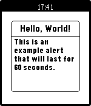

pebble-alert-lib
================

Source code for a simple alert mechanism for Pebble apps.

Instructions for Use:
---------------------

1. Copy alert.h and alert.c to your project /src folder.
2. #include "alert.h"
3. Call alert_show(...) to shown alert.
4. Call alert_update(...) to update it.
5. Call alert_cancel() to remove it.

Issues?
-------
If you find any issues, please let me know!
